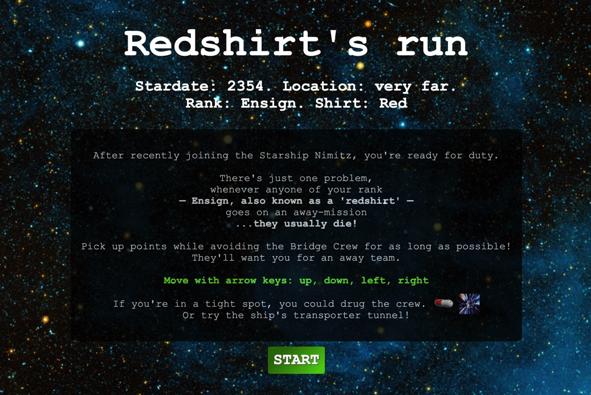

# Redshirt's run

This game, inspired by Pacman and Star Trek involves a player inside a maze, being chased by a group of characters ('enemies').
The player picks up points along their route. The aim is to pick up as many points as possible before being caught by the enemies.

This is my first project, built in one week, three weeks into my Software Engineering Immersive at General Assembly.

## Goal and Brief

* A grid-based, pacman-inspired game, renedered in the browser
* Logic for losing and winning
* The player should be able to clear at least one board
* The player's score should be displayed at the end of the game
* Deploy the game online

### Timescale
* 7 days

### Technologies used
* Vanilla JavaScript (ES6)
* HTML5
* CSS
* Github

### Underlying inspiration, Pac Man:
Pac Man is a classic arcade game from the 80s. The player aims eat all the food in a maze whilst being hunted by ghosts.

If the player eats special flashing food the ghosts start to flash and can now be captured by the player, sending them back to their holding pen, from where they can once again start to hunt the player.

The aim is to achieve the highest score possible before being killed by the ghosts.

## The Game: Redshirt's run

### Live version

**A live version of the game can be [found here](https://simon994.github.io/sei-project-1/)**

### Game screenshots and demo

#### Starting screen with instructions

#### Game-play sample

### General information on game-play

* There is one player, who starts with a score of zero. 
* The player has an avatar on the board, in a red shirt.
* The player's avatar can be moved by the user, with their arrow-up, arrow-down, arrow-left and arrow-right keyboard keys.
* The player cannot move outside of passageways, which contain dots that the player can collect to increase score. The player can pass through a 'transporter tunnel', positioned roughly at the center of the far left and right walls of the board. Passing through the tunnel makes the player avatar appear on the opposite side of the board.
* The player starts with three lives.
* Enemies, whose movement is determined by the computer, will start the game in a 'chase' mode, and will hunt for the player.
* When a player moves over a pill (pills are positioned near the four corners of the board), all enemys' modes are changed for a few seconds to 'flee', before reverting back to a 'chase' mode.
* When the player collides with an enemy whose mode is 'flee', after a short delay that enemy's position is re-set to a point near the center of the board (representing the bridge on a starship).
* Score increases as the player moves over dots on the game board, or moves over a pill, or collides with an enemy whose mode is in 'flee' (which occurs for a set period of time after the player landed on a pill).
* When all dots on a current board have been removed, the dots are replenished (the player can then continue to increase their score, moving over the dots). However, pills are not replenished in this way.
* Game play switches between two boards until the player loses all of their lives. On the first board, when the player collides with an enemy whose mode is not 'flee', the player does not lose a life but game-play moves to the second board. On this second board, if/when the player again collides with an enemy not in 'flee' mode, the player then loses one life and is returned to the first board, where game-play continues (all dots and pills are replenished).
* The game is over when the player looses all three of their three starting lives, or when the player reaches a specified winning score, which is the same as that for original pacman, 3,333,360.
* On the game ending, the player is given their final score and the option to play again, starting the game from scratch.

### Player and Enemy classes
There is a Player class and an Enemy class, which extends the class of Player. Class properties and methods are outlined in various sections below.

An instance of Player is stored as 'playerOne', along with four instances of Enemy (enemyOne, enemyTwo, enemyThree, enemyFour).

### Game grid
Game-play takes place on a grid. The starting point for forming the grid is a nested array of strings:

      const boardOne =
    [
      ['XXXXXXXXXXXXXXXXXXX'],
      ['XooooooooXooooooooX'],
      ['XoXXoXXXoXoXXXoXXoX'],
      ['XoooooooooooooooooX'],
      ['XoXXoXoXoXoXoXoXXoX'],
      ['XooooXoooXoooXooooX'],
      ['XXXXoXXXoXoXXXoXXXX'],
      ['XXXXoXoooooooXoXXXX'],
      ['XXXXoXoXXoXXoXoXXXX'],
      ['oooooooXoooXooooooo'],
      ['XXXXoXoXoooXoXoXXXX'],
      ['XXXXoXoXXoXXoXoXXXX'],
      ['XXXXoXoooooooXoXXXX'],
      ['XXXXoXoXXXXXoXoXXXX'],
      ['XooooooooXooooooooX'],
      ['XoXXoXXXoXoXXXoXXoX'],
      ['XooXoooooooooooXooX'],
      ['XXoXoXoXXXXXoXoXoXX'],
      ['XooooXoooXoooXooooX'],
      ['XoXXXXXXoXoXXXXXXoX'],
      ['XoooooooooooooooooX'],
      ['XXXXXXXXXXXXXXXXXXX']
    ]

 Starting with an array allows easy manipulation of the board appearance. One example of this is that a second board is also generated simply by reversing the array used above.
 
 In the array, walls are represented by 'X', and passageways by an 'o'.  

A function itterates over the array, creating a div for each 'X' and each 'o' and adding them to a rendered (grid) container. The divs are also styled accordingly via this function -- including, with help from a seperate function, addition of html that will render appearance of dots and pills on the grid. In addition, the function builds up another array ('cells'), containing information on all of the newly created divs and their attributes. Each element (cell) of the cells array can be thought of as having a y (vertical) and an x (horizontal) positon within the grid, which can be accessed as such: 

      cells[y][x] 

### Enemy chase and flee modes

The Enemy class has a mode -- with a value of either 'chase', or 'flee' -- that determines how it behaves with respect to the player. Upon instantiation of an enemy is set to chase. The mode is changed to flee when the player lands on a pill on the board (the mode of each enemy then remains in 'flee' for a set period of time, before reverting to 'chase').

#### character behaviour in different modes

The flee/chase modes alter the enemy behaviour:  

* If a player collides with an enemy that has a mode of 'flee', the enemy will disappear from its current position and its position will be re-set to the center of the board (where the enemy will appear a short time later). Such a collision also results in an additional score being awarded to the player.

* If a player collides with an enemy that is in 'chase' mode, a function (endGame) will be called to handle further game play, which could mean moving to a different board or completely ending the game, depending on other conditions (see also below).

* Whether an enemy is in flee or chase mode also alters its movement (see section on Enemy positioning and movement)

### Enemy positioning and movement

 All instances of Player and Enemy are instantiated with y and x coordinates that position their avatar on the grid (see Game Grid section above).

#### Deciding a direction

Before each enemy makes a move, it will decide which direction to move.  

The Enemy class has a method, decideDirection that is repeatedly called (for each instantiated enemy) at intervals during gameplay. 

The decideDirection method calls other methods (checkRight, checkLeft, checkUp and checkDown) that allow an enemy to determine the coordinates of the cells immediately to the right, left, up and down, around its position. With this information, each enemy can determine whether the cell in question is a passageway (allowing movement), or a wall (dissalowing movement). The enemy also has its own x and y position properties, as well as a method to determine the player's current (x-y) position on the grid. Using this information, the enemy can determine whether any given cell immediately around it is closer or further from the player's position (in terms of a straight line drawn from enemy to player).

Conditions are also added in decideDirection to avoid enemies back-tracking during their movement. Specifically, enemies have a property (lastMove) that stores information about their previous move. This is then used when deciding which move should be made next.

##### Movement behaviour depending on mode
Before each move, each enemy iterates through directions (right, left, up or down) and, using knowledge of its current x-y position on the grid versus the player's current position, sorts the directions into a list with the first direction in the list being the most desirable move and the last being least desirable.  

The enemy will work its way through the list and attempt to move first in the most desirable direction. If this direction is not possible (for example, there is a wall rather than passage in that direction), then a move in the next most desirable direction is attempted. The enemy continues to attempt to move until it is able to successfully make a move (until its x and y position properties change). If for any reason the enemy is unable to find a direction to successfully move in (which may occassionally be the case if the enemy is in a corner), we simply return out of the method and await a new call to decideDirection.

When the enemy is in 'chase' mode, the sorting order results in the first move to try (the most desirable move) being that which will minimise the straight-line distance to the player position. If there are two or more potential moves that offer equal reduction in distance to the player, a random choice is made between these desired moves.

Conversely, when the enemy is in 'flee' mode (after the player has landed on one of the pills on the board), the movement sorting order is reversed: the most desirable (first) move will be that which results in the greatest possible increase in straight-line distance from the player's current position.

#### Movement timing
decideDirection (and thereby, enemy movement) is called at slightly different rates for different enemy instances in chase mode. Doing this means that over time enemies spread out across the board, thus providing more interesting gameplay.

### Enemy mode changes
The enemy's mode changes when the player lands on a pill on the board.
When this happens, a function, bigDogTriggerFlee is called. This function clears all timers (intervals) associated with enemy movement. It then sets all instantiated enemys' modes to 'flee', after which another function is called which re-starts game play, with appropriate timings and behavior (fleeing) for each enemy. After a few seconds, all movement timers are again cleared, enemy modes are re-set to 'chase' and new timers (intervals) are called to once again decide movement with enemies in chase mode.

### Collision detection and end of game
A function, detectCollision, handles detection of collisions between enemies and the player. At regular intervals of 40 ms, each enemy checks whether its current position on the grid matches that of the player. If it does, and if the enemy in question is in 'chase' mode, then another function, endGame, is called to handle ending the game (which could involve moving the gameplay to the alternate grid or involve completely ending the game). If the enemy that detected collision is in a 'flee' mode, then that enemy's position is re-set, via another function resetDrugged, to the center of the board. 

endGame clears all intervals that have been set during the previous game. If the winning score has not been reached, the function checks which board the play is currently on:
*  If play is on board two, the player loses a life. If player lives are subsequently equal to zero, then another function is run to display a game-over message and final score. Alternatively, if player lives remain above zero, a message is displayed indicating to the player that they have lost a life and will switch boards. 
*  If play is on board one, when the player collides with an enemy whose mode is not 'flee', game-play moves to a second board: A message is displayed to let the player know they will switch boards (go on an away mission) 

The endGame function (see above section) is also called if the player reaches the winning score, which is stored in the constant winScore.

## Potential future improvements

Possible improvements or additional features could include:

